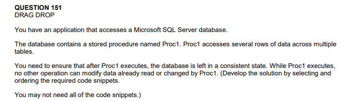
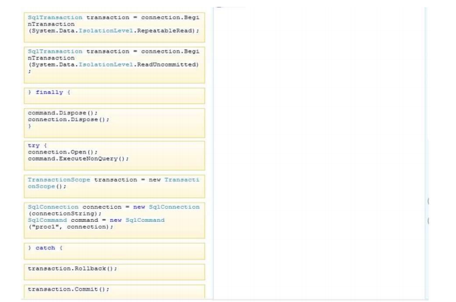
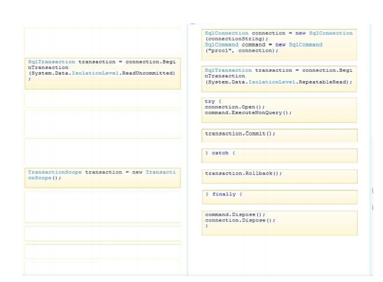

# Question 151

Box 1: Start with the sqlconnection   
Box 2: Open the SQL transaction (RepeatableRead)   
- IsolationLevel - Specifies the isolation level of a transaction.
- RepeatableRead 
- Volatile data can be read but not modified during the transaction. New data can be added during the transaction.
- ReadCommitted - Volatile data cannot be read during the transaction, but can be modified.
- ReadUncommitted - Volatile data can be read and modified during the transaction.     

Box 3: Try the query    
Box 4: commit the transaction    
Box 5: Catch the exception (a failed transaction)    
Box 6: Rollback the transaction   
Box 7: Final cleanup   
Box 8: Clean up (close command and connection).    

Enlace de referecia: https://docs.microsoft.com/en-us/dotnet/api/system.data.sqlclient.sqlconnection.begintransaction?view=dotnet-plat-ext-5.0
