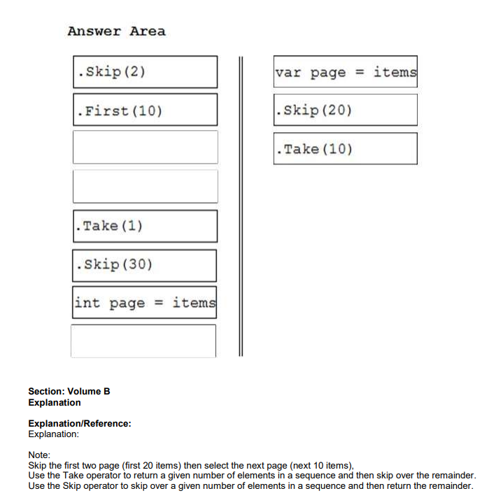
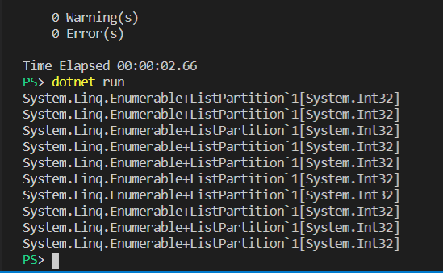

# Question 152

DRAG DROP    
Tenemos una aplicación que muestra 10 elementos por página.    
Tenemos que mostrar la tercera página.   
Dessarrolla una aplicación seleccionando y ordenando el código de snippets requerido (no necesitas todos los snippets).      

# Al ejecutar me sale esto (10 elementos):

 

 Enlaces de referencia:     
 https://docs.microsoft.com/en-us/dotnet/framework/data/adonet/sql/linq/return-or-skip-elements-in-a-sequence    
 https://stackoverflow.com/questions/43323630/for-loop-with-20-items-skip-each-time        
 https://csharp.net-tutorials.com/linq/limiting-data-the-take-skip-methods/         
