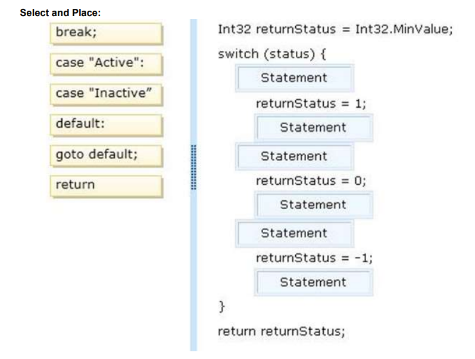

# Question 153
You have a method that will evaluate a parameter of type Int32 named Status.    
You need to ensure that the method meets the following requirements:      
If Status is set to Active, the method must return 1.
If Status is set to Inactive, the method must return 0.
If Status is any other value, the method must return -1.

What should you do? (To answer, drag the appropriate statement to the correct location in the answer area.
Each statement may be used once, more than once, or not at all. You may need to drag the split bar between
panes or scroll to view content.)     

Enlaces de referencia:    
https://www.w3schools.com/cs/cs_switch.asp    
https://docs.microsoft.com/es-es/dotnet/csharp/language-reference/keywords/switch     