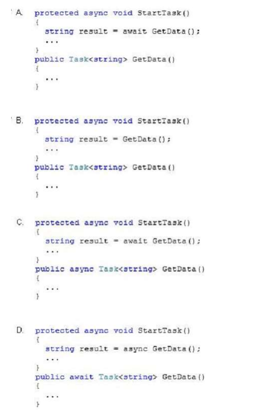

# Question 154
You are developing an application that uses multiple asynchronous tasks to optimize performance. The
application will be deployed in a distributed environment.   
You need to retrieve the result of an asynchronous task that retrieves data from a web service. The data will be
later being parsed by a separate task.    
Which code segment should you use?    

Enlaces de referencia:    
https://docs.microsoft.com/es-es/dotnet/csharp/programming-guide/concepts/async/    
https://docs.microsoft.com/es-es/dotnet/csharp/programming-guide/concepts/async/task-asynchronous-programming-model     