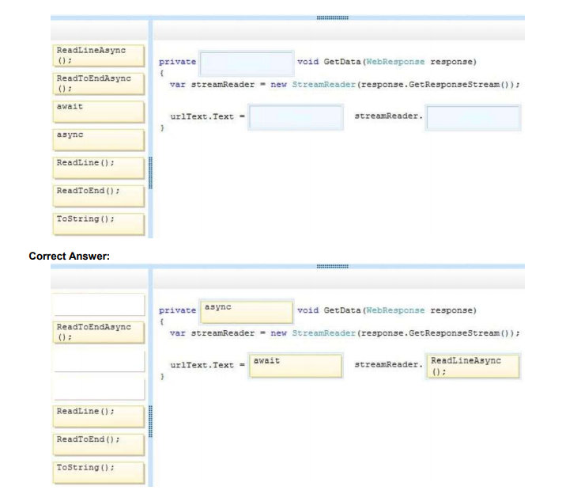

# QUESTION 26
DRAG DROP    

You are developing an application that will include a method named GetData. The GetData() method will
retrieve several lines of data from a web service by using a System.IO.StreamReader object.  

You have the following requirements:    

-The GetData() method must return a string value that contains the first line of the response from the web
service    

-The application must remain responsive while the GetData() method runs.     
You need to implement the GetData() method.

How should you complete the relevant code? (To answer, drag the appropriate objects to the correct locations
in the answer area. Each object may be used once, more than once, or not at all. You may need to drag the
split bar between panes or scroll to view content.)    

