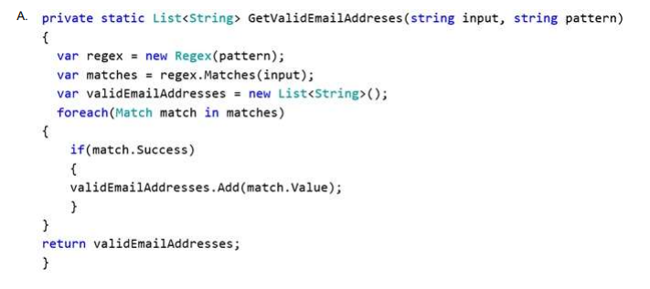
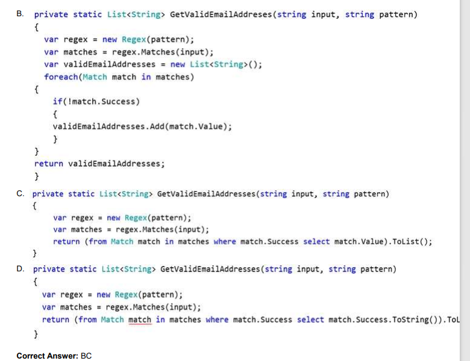

# QUESTION 57

You are implementing a method named GetValidEmailAddresses. The GetValidEmailAddresses ()
method processes a list of string values that represent email addresses    

The GetValidEmailAddresses () method must return only email addresses that are in a valid format.    

You need to implement the GetValidEmailAddresses() method.   

Which two code segments can you use to achieve this goal? Each correct answer presents a complete
solution.   

