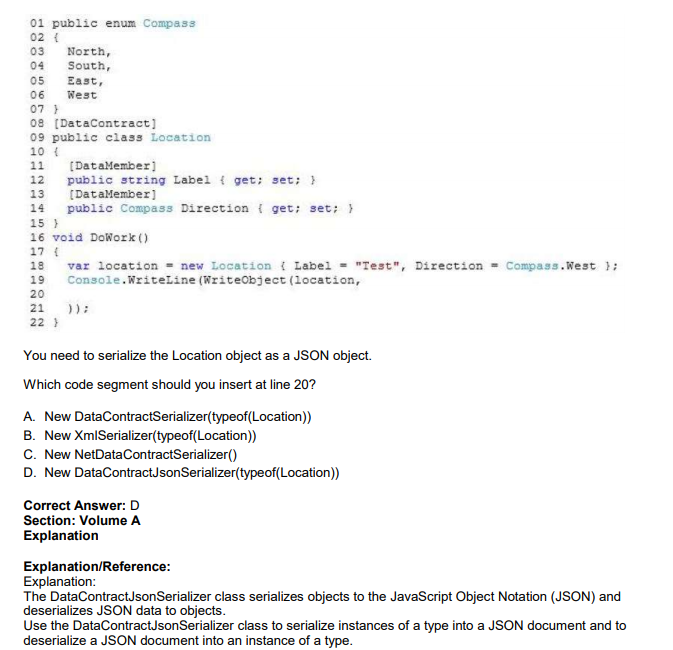

# QUESTION 9

You are developing an application. The application converts a Location object to a string by using a method
named WriteObject. The WriteObject() method accepts two parameters, a Location object and an
XmlObjectSerializer object.      
The application includes the following code. (Line numbers are included for reference only.)    

