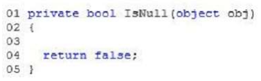
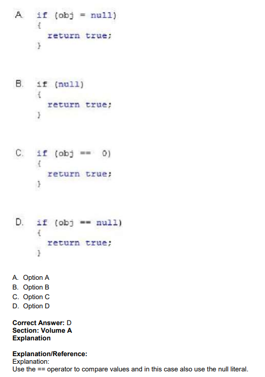

# QUESTION 94

You are developing an application that uses several objects. The application includes the following code
segment. (Line numbers are included for reference only.)    

You need to evaluate whether an object is null.   
Which code segment should you insert at line 03?    

